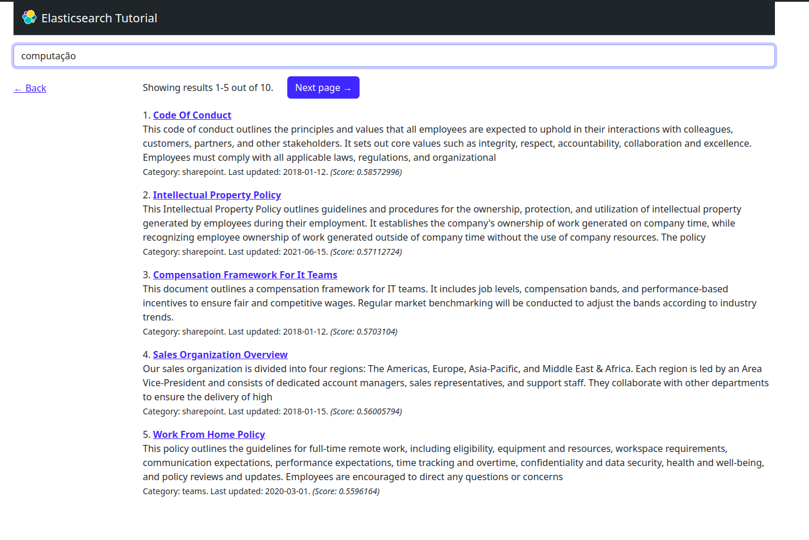

# Busca Semântica com Elastic Search

Este projeto é uma pequena aplicação web que implementa busca semântica com o banco de dados *elastic search*.



## Uma pequena explicação
Provavelmente se você chegou até aqui é por que conhece o mínimo do conceito. Mas aqui vai uma pequena explicação.

Digamos que você esteja fazendo um blog. Nesse blog haverá uma mecanismo de busca para pesquisar por título do artigo, nome do autor, etc. Se você tiver implementado essa busca com `query`, o mecanismo será por comparação letra por letra ou palavras chaves. Se eu pesquisar pelo título com a palavra `fut` o mecanismo mostrará todos os artigos nos quais o título contém o `fut`, por exemplo `Maiores pisas do futebol` ou `O melhor episodio de futurama`. Porém essa busca não é tão incrível quanto parece. E se eu quisesse pesquisar por `altas pontuações de um time contra outro time em um jogo de bola`, com certeza não iria aparecer o artigo `Maiores pisas do futebol`. A busca semântica vem para nos salvar e resolver isso.

A busca semântica com similaridade de vetores é uma técnica avançada de recuperação de informações que usa a semântica, ou o significado das palavras, para produzir resultados de pesquisa altamente relevantes. Neste método, as palavras são representadas como vetores em um espaço multidimensional(ou os chamados *embeddings*), conhecido como **espaço vetorial** semântico. A posição de cada vetor neste espaço é determinada pelo contexto em que a palavra é usada, de modo que palavras com significados semelhantes estão próximas umas das outras no espaço vetorial.

Quando um termo de pesquisa é inserido, ele é transformado em um vetor de números e a similaridade entre esse vetor de consulta e os vetores de todas as palavras no banco de dados é calculada. Isso geralmente é feito usando uma função de similaridade, como a similaridade do cosseno(olha aí, não foi você quem disse que Algébra Linear não servia pra nada?!).

A busca semântica é particularmente útil para lidar com sinônimos (palavras com significados semelhantes), polissemia (palavras com mais de um significado) e outras complexidades da linguagem natural.

## Requisitos
- **Python** - V3.8 ou mais recente
- **Flask**: framwork web para python
- Um terminal linux(se estiver usando windows, use o WSL ou procure por os comandos equivalentes no terminal windows)
- conta no elastic-DB

## Como Rodar:
Existem dois diretórios: `/basic-search` que implementa a busca por palavra-chave que retorna resultados que correspondem a palavra pesquisada. No diretório `/vector-search` temos a busca semantica usando a similaridade de coseno nos *embeddings*.

Siga os passos abaixo em ordem:

- Mova-se para o diretório que desejar:
    ```Vim
    cd <nome-diretório>
    ```
- Crie um ambiente virtual para instalar as dependências:
    ```Vim
    python3 -m venv .venv
    ```
- Ative o ambiente:
    ```Vim
    source .venv/bin/activate
    ```
- Instale as dependências:
    ```Vim
    pip install -r requirements.txt
    ```
- Faça a conexão com o elastic cloud e com a API key:
    Crie um banco de dados Elastic Cloud e uma API Key. Veja mais detalhes [aqui](https://www.elastic.co/search-labs/tutorials/install-elasticsearch/elastic-cloud). E cole seus `cloud_id` e `api_key` no arquivo `.env`.  
    ```Vim
    ELASTIC_CLOUD_ID="cole seu Cloud ID aqui"
    ELASTIC_API_KEY="cole sua API Key aqui"
    ```
- Popule o banco de dados e crie os índices:
    ```Vim
    flask reindex
    ```
- Execute a aplicação web:
    ```Vim
    flask run
    ```
Por fim, busque qualquer coisa na barra de pesquisa que aparecerá ao acessar a URL. O projeto já vem com um banco de dados, o arquivo `data.json`. Porém, para sua diversão, é melhor criar um pois terá conhecimento dos dados, assim você verá o quão incrível é a busca semântica.

## Sobre os Embeddings

Na busca semântica, usamos um gerador de embeddings localmente em nossa máquina. Foi usado o modelo *all-MiniLM-L6-v2* que gera veteores com 384 dimensões. modelo treinado com mais de 1 bilhão de pares de treinamento e projetado como modelos de uso geral.

## Duvidas
Para informações mais detalhadas veja a documentação do [Elastic](https://www.elastic.co/search-labs/tutorials/search-tutorial/welcome).